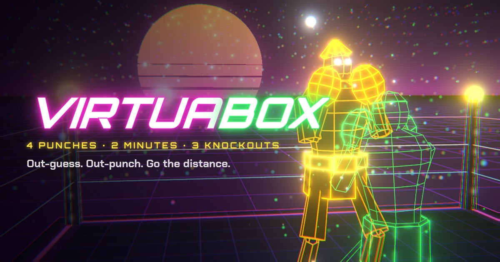

# VIRTUABOX

Up down all around. A two-minute, mobile-first neon boxing game: a green
wireframe boxer in a 3D synthwave ring, a Punch-Out-style split screen, and
rock-paper-scissors mind games at 60fps.



## How it plays

1. Each round you call **4 punches**, one per slot, from a 2×2 pad:
   **JAB** ↖, **HOOK** ↗, **UPPER** ↘, **BODY** ↙.
2. Every punch **beats the next one clockwise** (JAB › HOOK › UPPER › BODY › JAB).
   Diagonals **trade** (both land). The same punch **clashes** (gloves collide).
3. The opponent's **intel** reveals some of their punches before you lock in.
   Chain wins for combo multipliers, and KO all three fighters before the
   **2:00** clock runs out.

| Fighter | Style | Intel | Shot clock |
| --- | --- | --- | --- |
| PIXEL PETE | Pattern boxer who loves the jab | 2 punches | 8s |
| NOVA KID | Copycat who repeats your last combo | 1 punch | 7s |
| MEGAVOLT | Counter-puncher who reads your habits | 1 punch | 6s |

When the match ends you get a score card PNG (with a frame captured from your
knockout) to share through the native share sheet, or to save/copy on desktop.

Keyboard: `Q` jab, `W` hook, `A` body, `S` upper, `Backspace` to undo,
`Enter` to start.

## Run it

It's a static site with no build step. Serve the folder with any web server:

```sh
python3 -m http.server 8080
# or: npx serve .
```

Then open http://localhost:8080 (on a phone, use your machine's LAN IP).

## Layout

```
index.html              page shell, HUD, deck, overlays, meta/OG tags
styles.css              mobile-first layout (portrait split, landscape side-by-side)
js/main.js              game flow: rounds, exchanges, scoring, HUD, results
js/rules.js             move wheel, damage/score constants, opponent AI
js/boxer.js             procedural wireframe boxer: 2-bone IK rig + punch/hit/KO animations
js/stage.js             three.js scene: arena, crowd, sun, particles, camera shots, bloom
js/audio.js             ElevenLabs samples + WebAudio synth fallback
js/share.js             1080×1350 share card + share text
js/vendor/three.js      tree-shaken three.js r186 bundle (generated)
audio/                  generated SFX, announcer lines and soundtrack (mp3)
icons/, og.jpg          favicon, PWA icons, social preview (generated)
manifest.webmanifest    installable PWA manifest
tools/                  asset/bundle generators
```

## Regenerating assets

```sh
# three.js bundle (after adding new THREE.* symbols to js/)
npm i --no-save three@0.186.1 esbuild && node tools/build-vendor.mjs

# PNG icons + og.jpg (renders the real 3D scene headlessly)
npm i --no-save playwright-core && node tools/render-assets.mjs

# SFX, announcer and music via ElevenLabs (delete a file to regenerate it)
ELEVENLABS_API_KEY=... node tools/gen-audio.mjs
```

Never commit API keys; `tools/gen-audio.mjs` only reads the key from the
environment.

The `og:image` tag uses a relative path. Some link unfurlers need an absolute
URL, so point it at the deployed `og.jpg` once the site has a home.

Debug query params: `?cam=y,dist,lookY,x,hfov` tunes the fight camera,
`?ts=0.2` slows time, `?dtcap=0.25` lets slow headless browsers keep pace.
